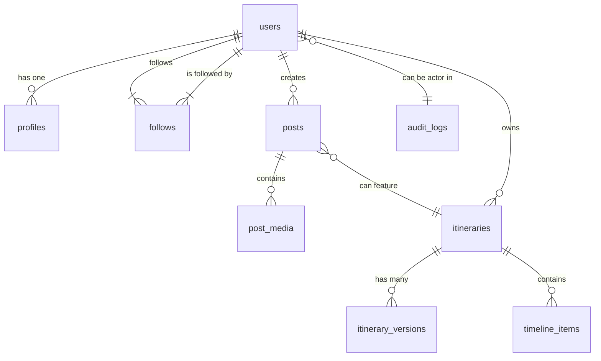

# DreamLnds: Supabase Database Schema

## 1. Overview

This document outlines the database schema for the DreamLnds project, designed for implementation in Supabase (PostgreSQL). The schema is divided into three logical parts: **Social**, **Planner**, and **Admin**. All tables will be created within the `public` schema in Supabase, but are organized here for clarity.

Row Level Security (RLS) will be enabled for all tables to ensure data is only accessible by authorized users.

---

## 2. Social Schema

This schema handles all user-related and social networking features.

### `users` (managed by Supabase Auth)
This table is automatically created and managed by Supabase Auth. It contains user authentication information.

- `id` (uuid, primary key): User ID from Supabase Auth.
- `email` (text): User's email address.
- ... (other auth-related fields)

### `profiles`
Stores public-facing user profile information.

- `id` (uuid, primary key, foreign key to `users.id`)
- `username` (text, unique): Unique, user-chosen username.
- `full_name` (text)
- `avatar_url` (text): URL to the user's profile picture in Supabase Storage.
- `bio` (text, nullable): A short user biography.
- `website_url` (text, nullable): Link to the user's personal website.
- `created_at` (timestamp with time zone)
- `updated_at` (timestamp with time zone)

**RLS Policies:**
- Users can read all profiles.
- Users can only update their own profile.

### `follows`
Represents the relationship between users (following/followers).

- `follower_id` (uuid, foreign key to `users.id`)
- `following_id` (uuid, foreign key to `users.id`)
- `created_at` (timestamp with time zone)

**RLS Policies:**
- Users can read all follow relationships.
- Users can only insert/delete rows where they are the `follower_id`.

### `posts`
Stores user-generated posts in the social feed.

- `id` (uuid, primary key)
- `user_id` (uuid, foreign key to `users.id`)
- `content` (text): The text content of the post.
- `itinerary_id` (uuid, nullable, foreign key to `planner.itineraries.id`): An optional link to a shared itinerary.
- `visibility` (enum: `public`, `followers_only`, `private`)
- `created_at` (timestamp with time zone)

**RLS Policies:**
- Users can read `public` posts and posts from users they follow.
- Users can only create/update/delete their own posts.

### `post_media`
Associates media (images/videos) with posts.

- `id` (uuid, primary key)
- `post_id` (uuid, foreign key to `posts.id`)
- `media_url` (text): URL to the media file in Supabase Storage.
- `media_type` (enum: `image`, `video`)
- `sort_order` (integer): To order multiple media items in a post.

**RLS Policies:**
- Users can read media for posts they are allowed to see.

---

## 3. Planner Schema

This schema manages all data related to the AI-powered travel planner.

### `itineraries`
- `id` (uuid, primary key)
- `user_id` (uuid, foreign key to `users.id`)
- `title` (text): e.g., "10 Day Trip to Paris".
- `start_date` (date)
- `end_date` (date)
- `destination_city` (text)
- `current_version_id` (uuid, nullable, foreign key to `itinerary_versions.id`)
- `is_public` (boolean, default: false)
- `created_at` (timestamp with time zone)

**RLS Policies:**
- Users can only read/update their own itineraries, unless `is_public` is true.

### `itinerary_versions`
Stores a snapshot of the itinerary every time a significant change is made.

- `id` (uuid, primary key)
- `itinerary_id` (uuid, foreign key to `itineraries.id`)
- `version_number` (integer)
- `itinerary_data` (jsonb): The full JSON object of the itinerary at this version.
- `created_at` (timestamp with time zone)

**RLS Policies:**
- Users can only read versions of their own itineraries.

### `timeline_items`
Represents a single event (activity, meal, etc.) within an itinerary. This table is for relational queries, while the full data lives in `itinerary_data`.

- `id` (uuid, primary key)
- `itinerary_id` (uuid, foreign key to `itineraries.id`)
- `day` (date)
- `start_time` (time with time zone)
- `duration_minutes` (integer)
- `kind` (enum: `activity`, `meal`, `transfer`, `hotel_checkin`)
- `place_id` (text, nullable): Google Place ID.

**RLS Policies:**
- Users can only access items related to their own itineraries.

---

## 4. Admin Schema

This schema provides tools for platform administration.

### `feature_flags`
- `id` (serial, primary key)
- `name` (text, unique): e.g., "enable-new-search-agent".
- `is_active` (boolean, default: false)
- `description` (text)

**RLS Policies:**
- Only users with an `admin` role can read/write.

### `audit_logs`
- `id` (bigserial, primary key)
- `timestamp` (timestamp with time zone)
- `actor_id` (uuid, nullable, foreign key to `users.id`): Who performed the action.
- `action` (text): e.g., "user.banned", "post.deleted_by_moderator".
- `target_id` (uuid, nullable): The ID of the object that was acted upon.
- `details` (jsonb, nullable): Additional context.

**RLS Policies:**
- Only users with an `admin` role can read.

---

## 5. Entity-Relationship Diagram (ERD) - High Level

This schema provides a solid foundation for DreamLnds, balancing the relational needs of a social network with the flexible, document-based nature of AI-generated travel plans. The versioning system for itineraries is key to enabling features like undo/redo and tracking the evolution of a user's dream trip.

---

## 6. Caching Schema

To minimize API costs and improve performance for frequently requested data, we will implement a caching layer directly within the database. These tables will store the results from external APIs like Google Maps and OpenAI.

### `cache_places_details`
Stores detailed information for a specific Google Place ID.

- `place_id` (text, primary key): The Google Place ID.
- `data` (jsonb): The full JSON response from the Google Places Details API.
- `last_fetched` (timestamp with time zone): When the data was last fetched.
- `expires_at` (timestamp with time zone): When the cache entry should be considered stale (e.g., 30 days).

### `cache_routes`
Stores the calculated route (polyline, duration, distance) between two points.

- `cache_key` (text, primary key): A unique key generated from the origin, destination, and travel mode (e.g., `place_id_A:place_id_B:driving`).
- `data` (jsonb): The JSON response from the Google Directions/Routes API.
- `last_fetched` (timestamp with time zone)
- `expires_at` (timestamp with time zone)

### `cache_ai_responses`
Stores responses from OpenAI for specific, repeatable queries (e.g., summarizing a location's reviews).

- `cache_key` (text, primary key): A hash of the prompt or a unique identifier for the request.
- `data` (jsonb): The JSON response from the OpenAI API.
- `last_fetched` (timestamp with time zone)
- `expires_at` (timestamp with time zone)
